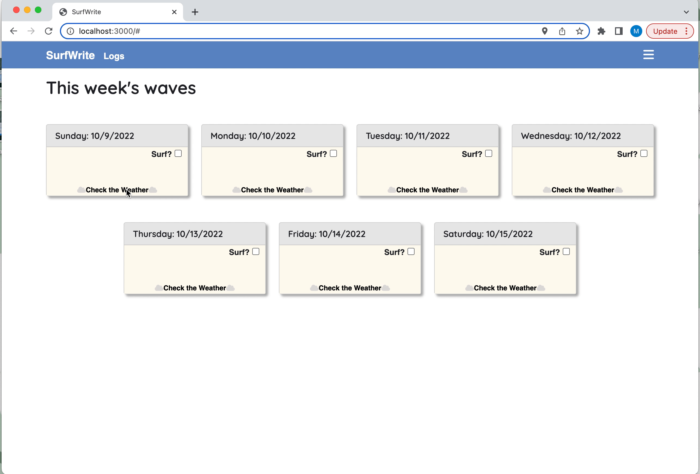

# SurfWrite

A full stack JavaScript application for surfers who want to keep track and log the days they went surfing.

## Why I Built This

I have several friends that like to surf and who have introduced me to the sport. I noticed that my friends would upload their surfing progress through other social media sites, but there wasn't a way for them to keep record of their progess in a personal journal or diary-like form. I wanted to build an application that was solely focused on surfing, where my friends could conveniently keep track and write journal logs. 

## Technologies Used

- React.js
- Webpack
- Bootstrap 5
- Node.js
- Express.js
- PostgreSQL
- Pgweb
- HTML5
- CSS3
- JavaScript (ES6)
- Dokku
- dotenv
- Open-Meteo Weather Forecast API
  - documentation: https://open-meteo.com/en/docs

## Live Demo

Try the application live at [SurfWrite](https://surfwrite.moniquechang.com)

## Features

- Users can check the weather for each day of the week.
- Users can mark the days they went surfing.
- Users can write journal logs on the days they went surfing. 
- Users can view past logs/entries.

## Preview

- Feature Shown
  - Users can check the weather for each day of the week.



## Stretch Features I Would Like To Implement

- Users can upload pictures for the days they went surfing
- Users can delete journal entries
- Users can upload videos for the days they went surfing

## Development

### System Requirements

- Node.js 10 or higher
- NPM 6 or higher
- PostgreSQL 14 or higher

### Getting Started

1. Clone the repository.

    ```shell
    git clone git@github.com:moniquechang/surfwrite.git
    cd surfwrite
    ```

1. Create a `.env` file from the example template.

    ```shell
    cp .env.example .env
    ```
    
1. Install all dependencies with NPM.

    ```shell
    npm install
    ```

1. Install [PostgreSQL](https://www.postgresql.org/download/)

1. Start PostgreSQL and create database.

    ```shell
    sudo service postgresql start
    createdb nameOfDatabase
    ```

1. Update the `DATABASE_URL` to point to your PostgreSQL database.

1. Initialize the database.

    ```shell
     npm run db:import
    ```

1. Start the project. Once started you can view the application by opening http://localhost:3000 in your browser.

    ```shell
    npm run dev
    ```
1. If prompted, allow browser to access your location (need location for weather API to properly work)
